# 3D_vision
My 3D vision journey

<h2 align="center">
      <i class="fas fa-calendar-day" aria-hidden="true">  Day 1 of #3D_vision_journey </i>
</h2>

<p align="center">
    
</p>

`Hello world`

- [Day 01](day01)

### Lessons Learned

- [x] install open3D
- [x] load Pointcloud data
- [x] visualize Pointcloud data

### Screenshots

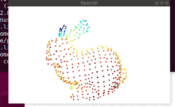 

***

<h2 align="center">
      <i class="fas fa-calendar-day" aria-hidden="true">  Day 2 of #3D_vision_journey </i>
</h2>

<p align="center">
    
</p>


- [Day 02](day02-05)

### Lessons Learned

- [x] PointCloud Voxel Downsampling
- [x] Vertex  Normal Estimation
- [x] Crop point cloud 

### Screenshots

| Original | Voxel Downsampling  | Normal Estimation | Crop Point Cloud |
|:---------------:|:---------------:|:---------------:|:---------------:|
|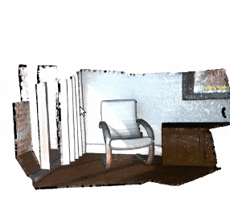  |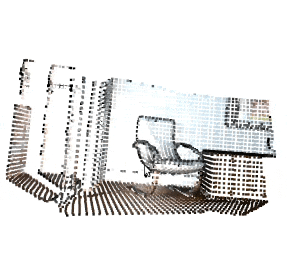|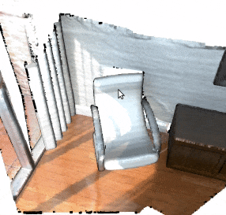 |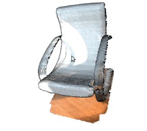 |

***

<h2 align="center">
      <i class="fas fa-calendar-day" aria-hidden="true">  Day 3 of #3D_vision_journey </i>
</h2>

<p align="center">
    
</p>


- [Day 03](day02-05)

### Lessons Learned

- [x] Painting point cloud 
- [x] Point cloud distance and removing object
- [x] Convex hull  

### Screenshots

| Painting point cloud | Removing object  | Convex hull  | 
|:---------------:|:---------------:|:---------------:|
|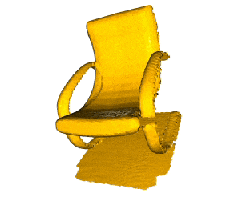  ||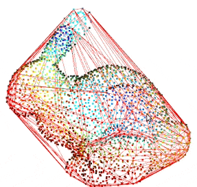 |

***

<h2 align="center">
      <i class="fas fa-calendar-day" aria-hidden="true">  Day 4 of #3D_vision_journey </i>
</h2>

<p align="center">
    
</p>

 

- [Day 04](day02-05)

### Lessons Learned

- [x] DBSCAN Clustering: Group local point cloud clusters together 
- [x] Plane segmentation 
- [x] Hidden point removal   

### Screenshots


<table>
  <thead>
    <tr>      
      <th>DBSCAN Clustering</th>
      <th>Plane segmentation</th>
      <th colspan="2">Hidden point removal</th>
    </tr>
  </thead>

  <tbody>    
    <tr>
      <td rowspan="2">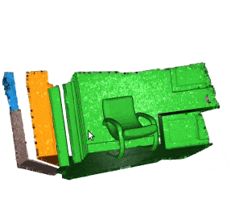</td>
      <td rowspan="2">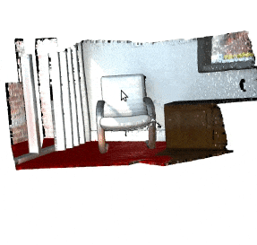</td>
      <td>Before</td>
      <td>After</td>
    </tr>
    <tr>      
      <td>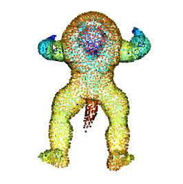</td>
      <td>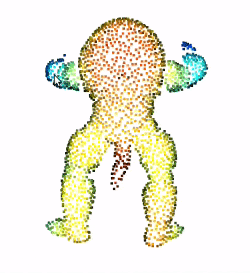</td>
    </tr>
  </tbody>
</table>

***

<h2 align="center">
      <i class="fas fa-calendar-day" aria-hidden="true">  Day 5 of #3D_vision_journey </i>
</h2>

<p align="center">
    
</p>


- [Day 05 C++ Examples](day02-05/src/)

RUN:
```
  mkdir build
  cd build
  cmake ..
  make

  cd ../bin
  ./pointCloud <path/to/fragment.ply>
```

### Lessons Learned

- [x] open3d c++ [CMakeLists.txt](day02-05/CMakeLists.txt) 
- [x] load Pointcloud data
- [x] visualize Pointcloud data
- [x] PointCloud Voxel Downsampling
- [x] Vertex  Normal Estimation
- [x] Crop point cloud 
- [x] DBSCAN Clustering: Group local point cloud clusters together 
- [x] Plane segmentation 
- [x] bounding box


### Screenshots

| C++ examples |  bounding box  | 
|:---------------:|:---------------:|
|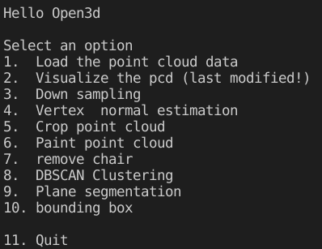  ||


***

<h2 align="center">
      <i class="fas fa-calendar-day" aria-hidden="true">  Day 6 of #3D_vision_journey </i>
</h2>

<p align="center">
    
</p>


- [Day 06](day06)

### Lessons Learned

**Finding neighbouring points**
- [x] Painting the 1500th point red  
- [x] KDTreeFlann
- [x] search_knn_vector_3d
- [x] search_radius_vector_3d 
- [x] search_hybrid_vector_3d 

### Screenshots

| Painting the 1500th point red | Find its 200 nearest neighbors: blue  | Find its neighbors with distance less than 0.2: green | Hybrid search |
|:---------------:|:---------------:|:---------------:|:---------------:|
|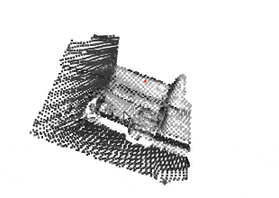  |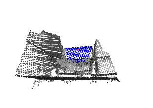|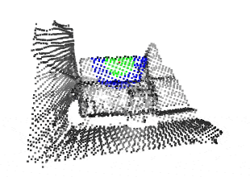 |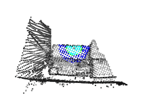 |
