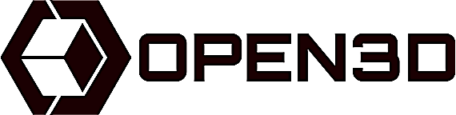
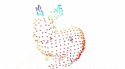
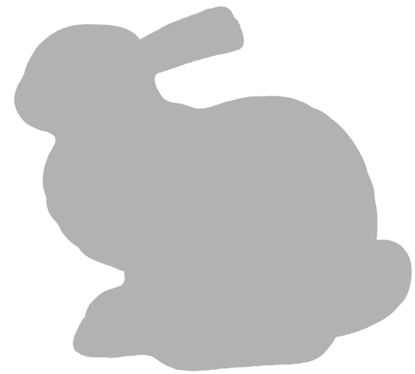

# 3D_vision
My 3D vision journey

<h2 align="center">
      <i class="fas fa-calendar-day" aria-hidden="true">  Day 1 of #3D_vision_journey </i>
</h2>

<p align="center">
    
</p>

`Hello world`

- [Day 01](day01)

### Lessons Learned

- [x] install open3D
- [x] load Pointcloud data
- [x] visualize Pointcloud data

### Screenshots

 

***

<h2 align="center">
      <i class="fas fa-calendar-day" aria-hidden="true">  Day 2 of #3D_vision_journey </i>
</h2>

<p align="center">
    
</p>


- [Day 02](day02-05)

### Lessons Learned

- [x] PointCloud Voxel Downsampling
- [x] Vertex  Normal Estimation
- [x] Crop point cloud 

### Screenshots

| Original | Voxel Downsampling  | Normal Estimation | Crop Point Cloud |
|:---------------:|:---------------:|:---------------:|:---------------:|
|  || | |

***

<h2 align="center">
      <i class="fas fa-calendar-day" aria-hidden="true">  Day 3 of #3D_vision_journey </i>
</h2>

<p align="center">
    
</p>


- [Day 03](day02-05)

### Lessons Learned

- [x] Painting point cloud 
- [x] Point cloud distance and removing object
- [x] Convex hull  

### Screenshots

| Painting point cloud | Removing object  | Convex hull  | 
|:---------------:|:---------------:|:---------------:|
|  || |

***

<h2 align="center">
      <i class="fas fa-calendar-day" aria-hidden="true">  Day 4 of #3D_vision_journey </i>
</h2>

<p align="center">
    
</p>

 

- [Day 04](day02-05)

### Lessons Learned

- [x] DBSCAN Clustering: Group local point cloud clusters together 
- [x] Plane segmentation 
- [x] Hidden point removal   

### Screenshots


<table>
  <thead>
    <tr>      
      <th>DBSCAN Clustering</th>
      <th>Plane segmentation</th>
      <th colspan="2">Hidden point removal</th>
    </tr>
  </thead>

  <tbody>    
    <tr>
      <td rowspan="2"></td>
      <td rowspan="2"></td>
      <td>Before</td>
      <td>After</td>
    </tr>
    <tr>      
      <td></td>
      <td></td>
    </tr>
  </tbody>
</table>

***

<h2 align="center">
      <i class="fas fa-calendar-day" aria-hidden="true">  Day 5 of #3D_vision_journey </i>
</h2>

<p align="center">
    
</p>


- [Day 05 C++ Examples](day02-05/src/)

RUN:
```
  mkdir build
  cd build
  cmake ..
  make

  cd ../bin
  ./pointCloud <path/to/fragment.ply>
```

### Lessons Learned

- [x] open3d c++ [CMakeLists.txt](day02-05/CMakeLists.txt) 
- [x] load Pointcloud data
- [x] visualize Pointcloud data
- [x] PointCloud Voxel Downsampling
- [x] Vertex  Normal Estimation
- [x] Crop point cloud 
- [x] DBSCAN Clustering: Group local point cloud clusters together 
- [x] Plane segmentation 
- [x] bounding box


### Screenshots

| C++ examples |  bounding box  | 
|:---------------:|:---------------:|
|  ||


***

<h2 align="center">
      <i class="fas fa-calendar-day" aria-hidden="true">  Day 6 of #3D_vision_journey </i>
</h2>

<p align="center">
    
</p>


- [Day 06](day06)

### Lessons Learned

**Finding neighbouring points**
- [x] Painting the 1500th point red  
- [x] KDTreeFlann
- [x] search_knn_vector_3d
- [x] search_radius_vector_3d 
- [x] search_hybrid_vector_3d 

### Screenshots

| Painting the 1500th point red | Find its 200 nearest neighbors: blue  | Find its neighbors with distance less than 0.2: green | Hybrid search |
|:---------------:|:---------------:|:---------------:|:---------------:|
|  || | |

***

<h2 align="center">
      <i class="fas fa-calendar-day" aria-hidden="true">  Day 7 of #3D_vision_journey </i>
</h2>

<p align="center">
    
</p>


- [Day 07 C++ KDTree](day06-07/src/)

RUN:
```
  mkdir build
  cd build
  cmake ..
  make

  cd ../bin
  ./KDTree
```

### Lessons Learned

- [x] open3d c++ [CMakeLists.txt](day06-07/CMakeLists.txt) 
- [x] path/to/the/pointCloud/data
- [x] Paint all points gray
- [x] Get access & Paint the Nth point
- [x] KNN Search (paint 200 NN points blue)
- [x] Radius Nearest Neighbors Search
- [x] Hybrid search


### Screenshots

 

***

<h2 align="center">
      <i class="fas fa-calendar-day" aria-hidden="true">  Day 8 of #3D_vision_journey </i>
</h2>

<p align="center">
    
</p>

`Point Cloud Outlier Removal` 

- [Day 08 python OutlierRemoval](day08/)

- [Day 08 C++ OutlierRemoval](day08/src/)

- [dataset: table_scene_lms400.pcd](https://github.com/PointCloudLibrary/data/blob/master/tutorials/table_scene_lms400.pcd)

 

RUN:
```
  mkdir build
  cd build
  cmake ..
  make

  cd ../bin
  ./OutlierRemoval
```

### Lessons Learned

- [x] open3d c++ [CMakeLists.txt](day08/CMakeLists.txt) 
- [x] Statistical outlier removal
- [x] Radius outlier removal

### Screenshots
| Original gray data   |  DownSampled    | Statistical outlier removal | Radius outlier removal| 
|:---------------:|:---------------:|:---------------------------:|:---------------------:|
|  ||  ||

_**Note:** Outliers: red points_


***

<h2 align="center">
      <i class="fas fa-calendar-day" aria-hidden="true">  Day 9 of #3D_vision_journey </i>
</h2>

<p align="center">
    
</p>

Point Cloud `shifting, scaling, and Voxelization` 

- [Day 09 python ](day09/)

- [Day 09 C++ ](day09/src/)

- [dataset: Bunny.ply](https://github.com/naucoin/VTKData/blob/master/Data/bunny.ply)

 

RUN:
```
  mkdir build
  cd build
  cmake ..
  make

  cd ../bin
  ./Voxelization
```

### Lessons Learned

- [x] open3d c++ [CMakeLists.txt](day09/CMakeLists.txt) 
- [x] Point cloud Shifting, and Scaling
- [x] Voxelization

### Screenshots
| 2 bunnies (One shifted up)   |  2 bunies (one Scaled)   | Voxelization | 
|:---------------:|:---------------:|:---------------------------:|
|  ||  |

***

<h2 align="center">
      <i class="fas fa-calendar-day" aria-hidden="true">  Day 10 of #3D_vision_journey </i>
</h2>

<p align="center">
    
</p>

Point Cloud `shifting, scaling, and Voxelization` 

- [Day 10 python ](day10/)
- [Day 10 C++ ](day10/src/)

 

RUN:
```
  mkdir build
  cd build
  cmake ..
  make

  cd ../bin
  ./PoissonSurfaceSeconstruction
```

### Lessons Learned

- [x] Poisson surface reconstruction
- [x] Visualizing Densities
- [x] Remove low density vertices
- [x] Mesh to point cloud
- [x] Alpha Shape
- [x] Ball pivoting
- [x] Normal estimation

### Screenshots
| Original PointCloud   |  Mesh (surface reconstructed)   |
|:---------------:|:---------------:|
|  ||

|Densities (Violet=low) | remove low densities |
|:---------------------:|:--------------------:|
|  |  |


| Mesh                  | mesh to point cloud (750 sampling) | Alpha Shape  |
|:---------------------:|:--------------------:|:--------------------:|
|  |  |  |

|  mesh to point cloud (3000 sampling) | Ball pivoting| Normal estimation
|:---------------------:|:----------------------:|:----------------------:|
| | | |
